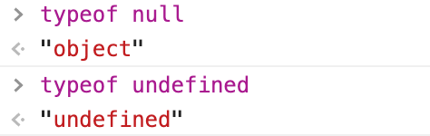
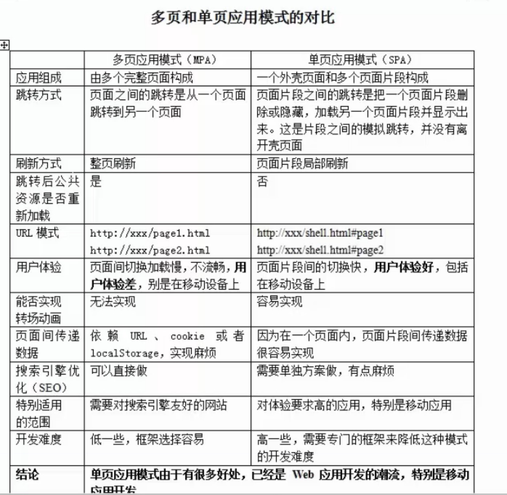
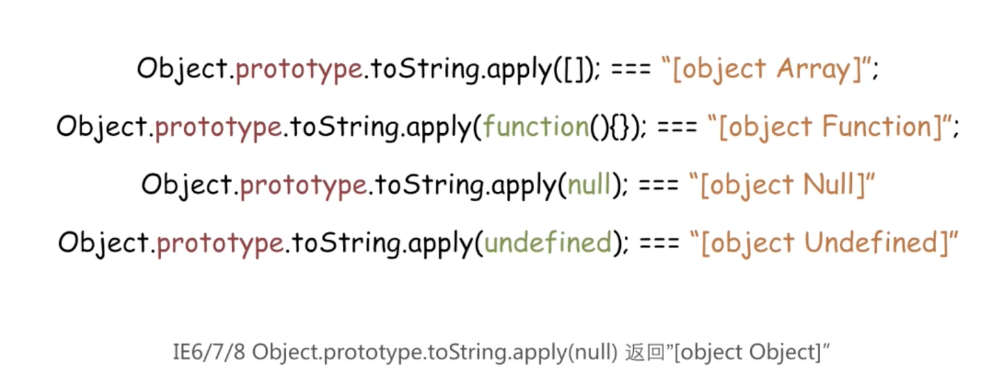

# js
## js数据类型

### 基本类型（单类型）：除Object。 String、Number、boolean、null、undefined。
+ undefined 代表的含义是未定义，null 代表的含义是空对象。一般变量声明了但还没有定义的时候会返回 undefined，null主要用于赋值给一些可能会返回对象的变量，作为初始化。

+ es6 新增的数据类型Symbol 类型，bigInt（ES2020,整数后面加个n, 例如2232322323n,或者BigInt(2232322323) //2232322323n ）
        
  Symbol 类型的对象永远不相等，即便创建的时候传入相同的值。因此，可以用解决属性名冲突的问题，做为标记。本质上是一种唯一标识符，可用作对象的唯一属性名，这样其他人就不会改写或覆盖你设置的属性值。
  ```js
    let id1 = Symbol('id');
    let id2 = Symbol('id');
    console.log(id1 == id2);  //false
  ```
+ Number类型只能安全的支持-9007199254740991(-(2^53-1)) 和 9007199254740991(2^53-1)之间的整数，任何超过这个范围的数值都会失去精度；而BigInt可以解决这个问题
### BigInt如何使用
1. 在整数的末尾追加n console.log(9007199254740999n)//9007199254740999
2. 调用BigInt()构造函数 
```js
var bigInt = BigInt("9007199254740999");      //传递给BigInt()的参数将自动转换为BigInt:
console.log(bigInt) //9007199254740999n 
```

## 前端路由主要有两种实现方法
vue路由原理
### hash(#)
window.location.assign：改变浏览器地址，生成一条新的历史记录

window.location.replace：改变浏览器地址，不会生成新的历史记录

window.location.onhashchange：改变路由hash 值的监听方法

Hash 路由:url 的 hash 是以 # 开头，原本是用来作为锚点，从而定位到页面的特定区域。当 hash 改变时，页面不会因此刷新，浏览器也不会向服务器发送请求。但是 hash 改变时，会触发相应的 hashchange 事件，回调里可以实现页面更新的操作，从而达到跳转页面的效果。
  ```js
    window.addEventListener('hashchange', function () {
      console.log('render');
    });

### history(window.history.pushstate(),window.history.replacestate())

window.history.pushstate：改变浏览器地址，生成一条新的历史记录

window.history.replacestate：改变浏览器地址，并覆盖当前历史记录

window.history.onpopstate：浏览器后退或前进时触发

History 路由:HTML5 规范中提供了 history.pushState 和 history.replaceState 来进行路由控制。通过这两个方法，可以实现改变 url 且不向服务器发送请求。同时不会像 hash 有一个 # ，更加的美观。但是 History 路由需要服务器的支持，并且需将所有的路由重定向到根页面。history模式，就会有个新的问题，就是页面刷新后，页面就无法显示了（404）。对于这个问题，我们只需要在服务器配置如果URL匹配不到任何静态资源，就跳转到默认的index.html。
我这里是针对nginx的配置，总结如下：
  ```js

    location /{
      root   /data/nginx/html;
      index  index.html index.htm;
      error_page 404 /index.html;
    }
  ```

History 路由的改变不会去触发某个事件，所以我们需要去考虑如何触发路由更新后的回调。

### 有以下两种方式会改变 url
1. 调用 history.pushState 或 history.replaceState；
2. 点击浏览器的前进与后退。
+ 第一个方式可以封装一个方法，在调用 pushState（replaceState）后再调用回调。
  ```js

  function push (url) {
    window.history.pushState({}, null, url);  
    //第一个参数state，状态对象是一个JavaScript对象，它与pushState()创建的新历史记录条目相关联，640k个字符的大小限制。当popstate触发时，可以拿到这个state，
    //第二个参数title，给新路由传递的标题，
    //第三个参数url，新历史记录条目的URL由此参数指定。 请注意，浏览器不会在调用pushState() 之后尝试加载此URL，但可能会稍后尝试加载URL，例如在用户重新启动浏览器之后。 新的URL不必是绝对的。 如果是相对的，则相对于当前URL进行解析。 新网址必须与当前网址相同 origin； 否则，pushState()将引发异常。 如果未指定此参数，则将其设置为文档的当前URL。
    handleHref();
  }
  function handleHref () {
    console.log('render')
  }

  ```

+ 第二个方式，浏览器的前进与后退会触发 popstate 事件。
  ```js
    window.addEventListener('popstate', handleHref);
  ```

调用history.pushState()或history.replaceState()不会触发popstate事件。只有在做出浏览器动作时，才会触发该事件，如用户点击浏览器的回退按钮（或者在Javascript代码中调用history.back()），history.pushState()，history.replaceState()只会改变当前地址栏的路径，不会刷新页面，不会更新页面内容

## 减少重回和重排方式
1. 直接改变className，合并多次的样式修改 
2. 将需要多次重排的元素，position属性设为absolute或fixed，这样此元素就脱离了文档流，它的变化不会影响到其他元素 
3. 由于display属性为none的元素不在渲染树中，对隐藏的元素操作不会引发其他元素的重排。如果要对一个元素进行复杂的操作时，可以先隐藏它，操作完成后再显示。这样只在隐藏和显示时触发2次重排。但是这可能导致浏览器的闪烁。
 
 
 
## 同一浏览器多页签共享数据
1. localStorage
2. cookie
3. websocket（服务端与客户端的双向通信）
4. possMessage cookie和localStorage是在同源同窗口中(协议，域名，端口都相同)都是共享的
  ```js
    // window_1 域名为 http://winodow1.com:8080
    window.postMessage("Hi, How are you!", "http://window2.com:8080")
    // window_2 域名为 http://window2.com:8080
    window.addEventListener("message", receiveMessage, false)
  ```

## Session和Cookie区别
Session是在服务端保存的一个数据结构，用来跟踪用户的状态，这个数据可以保存在集群、数据库、文件中；
Cookie是客户端保存用户信息的一种机制，用来记录用户的一些信息，也是实现Session的一种方式,session 因为 session id 的存在，通常要借助 cookie 实现
1. session 在服务器端，cookie 在客户端（浏览器）
2. session 默认被存在在服务器的一个文件里（不是内存）
3. session 的运行依赖 session id，而 session id 是存在 cookie 中的，也就是说，如果浏览器禁用了 cookie ，同时 session 也会失效（如果客户端的浏览器禁用了 Cookie 怎么办？一般这种情况下，会使用一种叫做URL重写，但是当我们把浏览器的cookie禁止后，web服务器会采用URL重写的方式传递Sessionid，我们就可以在地址栏看到 sessionid=KWJHUG6JJM65HS2K6之类的字符串）
4. session 可以放在 文件、数据库、或内存中都可以。
5. 用户验证，登录失效这种场合一般会用 session ，在页面中输入账号，自动弹出密码 用cookie
cookie目的可以跟踪会话，也可以保存用户喜好或者保存用户名密码
session用来跟踪会话。因此，维持一个会话的核心就是客户端的唯一标识，即 session id
 
## 项目优化
1. webpack: 
+ thread-loader: 把这个 loader 放置在其他 loader 之前， 后面的 loader就会在一个单独的 worker【worker pool】 池里运行，一个worker 就是一个nodeJS 进程
+ DllPlugin: 插件将特定的库提类前打包然后引入.这种方式可以极大的减少类库的打包次数，只有当类库有更新版本时才会重新打包，并且也实现了将公共代码抽离成单独文件的优化方案
+ cache-loader 或者 babel-loader 的 cacheDirectory: 可以将babel编译过文件缓存起来，以此加快打包时间
  ```js
    {
          test: /\.js$/,
          loader: 'babel-loader',
          options:{
                cacheDirectory:true,
          },
          exclude: [/node_modules/]
    },
  ```

+ HappyPack: 多线程打包,可以将Loader的同步执行转换为并行的(现在不再维护，推荐使用thread-loader)，注意，当项目较小时，多进程打包反而会使打包速度变慢
+ sourceMap: 正式环境关闭，不然会生成map文件，加大包体积
+ UglifyJSPlugin: 压缩js
+ Tree-sharking：作用：把一个一个块(chunk)打包在一起(bundle)的过程中，需要把无用的代码清除掉，来达到优化打包文件大小的目的。
2. http缓存
+ 304机制
3. 网络优化
dns预解析：
  ```js
    <head>
    <link rel="dns-prefetch" href="//hm.baidu.com">
    </head>
  ```

  向浏览器输入一个 URL 后，首先会进行 DNS 解析为对应的 IP 地址，开启了DNS prefetch后，浏览器在空闲时间会提前把这些域名转换为对应的 IP 地址，缓存到系统缓存中
  cdn加速:
  这是一种将网站内容通过缓存方式分发不同节点的技术.可以根据用户的请求地域，去选择一个离用户最近网络的缓存服务
  在静态资源的后面加上hash并上传到cdn服务器，最关键的还是index.html，index.html从公司源站获取，不缓存，每次都从服务器获取。注意打包时静态资源的域名设置为相应的cdn域名。

4. 静态资源优化：图片手动压缩；做雪碧图；使用svg图标；使用webp格式的图片。
5. js优化： 减少重绘重排，减少dom操作，删除等，相同对象抽离，节流、防抖。
6. css优化： 动画translate，使用flex代替浮动布局，增加进度条，loading效果，使用骨架屏。
7. html优化：少嵌套。
8. 懒加载：
+ 路由懒加载，在具体路由里import()而不是先都import进来
+ 图片懒加载，在图片没有进入可视区域时，先不给的src赋值，这样浏览器就不会发送请求了，等到图片进入可视区域再给src赋值
9. seo 优化
+ Title,h,p,strong 等标签
+ 语义化标签
+ 图片加alt,alt是当图片不存在时的替代文字;title是对图片的描述与进一步说明。搜索引擎对图片意思的判断，主要靠alt属性。所以在图片alt属性中以简要文字说明，同时包含关键词
+ 重要内容不要用 js 输出：爬虫不会执行 js 获取内容
+ 少用 iframe：搜索引擎不会抓取 iframe 中的内容
 
## 多页和单页应用模式的对比


## this绑定的四种方法
1. 默认绑定---当独立函数调用时，不管是否在调用栈中，this都指向全局对象（浏览器中为window）
2. 显式绑定---采用call()和apply(),bind()
3. 隐式绑定----当函数引用有上下文对象时，隐式绑定规则会把函数调用中的this绑定到这个上下文对象
  ```js
    function foo() {
        console.log( this.a );
    }
    
    var obj2 = {
        a: 42,
        foo: foo
    };
    
    var obj1 = {
        a: 2,
        obj2: obj2
    };
    
    obj1.obj2.foo(); // 42

  ```

4. new显式绑定this (权重最高)
发生了什么
+ 一个新的空对象被创建并分配给 this。
+ 函数体执行。通常它会修改 this，为其添加新的属性。
+ 返回 this 的值。
  ```js
    //换句话说，new User(...) 做的就是类似的事情：
    function User(name) {
      // this = {};（隐式创建）
    
      // 添加属性到 this
      this.name = name;
      this.isAdmin = false;
    
      // return this;（隐式返回）
    }
  ```
## for…in for…of
使用for…in遍历数组
遍历结果是key,数组下标
  ```js
    var a=[1,2,3];
    for(let i in a){
      console.log(i);//0 1 2
      console.log(a[i]);//1 2 3
    }
  ```

使用for in会遍历数组所有的可枚举属性，包括原型。
所以for in更适合遍历对象，不要使用for in遍历数组。
for in 可以遍历到原型方法,如果不想遍历原型方法和属性的话，可以在循环内部判断一下,hasOwnPropery方法可以判断某属性是否是该对象的实例属性
  ```js
    for (var key in myObject) {
    　　if（myObject.hasOwnProperty(key)){
    　　　　console.log(key);
    　　}
    }
  ```

使用for…of遍历数组
遍历结果是value,数组值
  ```js
    var a=[1,2,3];
    for(let i of a){
      console.log(i);//1 2 3
    }
  ```

## V8引擎机制
+ 预解析：检查语法错误但不生成AST
+ 生成AST：经过词法/语法分析，生成抽象语法树
+ 生成字节码：基线编译器(Ignition)将AST转换成字节码
+ 生成机器码：优化编译器(Turbofan)将字节码转换成优化过的机器码，此外在逐行执行字节码的过程中，如果一段代码经常被执行，那么V8会将这段代码直接转换成机器码保存起来，下一次执行就不必经过字节码，优化了执行速度
 
 
## 浏览器缓存
HTTP缓存有多种规则，根据是否需要重新向服务器发起请求来分类，我将其分为强制缓存，对比缓存（协商缓存）。

### 强制缓存判断http请求头中首部字段：
+ cache-control（标识资源可以在本地缓存多少秒），cache-control中的max-age保存一个相对时间。例如Cache-Control: max-age = 484200，单位为：秒(s)，表示浏览器收到文件后，缓存在484200s内均有效。
+ Expires（标识本地缓存的截止时间），这个时间是一个绝对时间，它是服务器的时间，因此可能存在这样的问题，就是客户端的时间和服务器端的时间不一致，或者用户可以对客户端时间进行修改的情况，这样就可能会影响缓存命中的结果

如果同时存在cache-control和Expires，浏览器总是优先使用cache-control。

(cache-control:no-store 禁止本地缓存，每次都需要从服务器端获取资源；no-cache资源可以被缓存，但是每次请求时都必须向服务器发起协商缓存；其等价于 max-age=0;must-revalidate)

### 当浏览器对某一个资源没有命中强制缓存时，则会启动协商缓存

对比缓存通过HTTP的last-modified，Etag字段进行判断。
+ last-modified是第一次请求资源时，服务器返回的字段，表示最后一次更新的时间。下一次浏览器请求资源时就发送if-modified-since字段。服务器用本地Last-modified时间与if-modified-since时间比较，如果不一致则认为缓存已过期并返回新资源给浏览器；如果时间一致则发送304状态码，让浏览器继续使用缓存。缺点可能时间变了内容没变。
+ Etag：ETag是第一次请求资源时，服务器返回的字段，是生成的一串唯一标识资源的字符串。下一次浏览器请求资源时就发送If-None-Match字段。服务器用本地ETag与If-None-Match比较，如果不一致则认为缓存已过期并返回新资源给浏览器；如果时间一致则发送304状态码，让浏览器继续使用缓存。
  ```js
    <meta http-equiv="Expires" CONTENT="0">
    <meta http-equiv="Cache-Control" CONTENT="no-cache">
   ```

### 区别

    cache-control:max-age = 484200，单位为：秒(s)

    Expires：Expires: Thu, 01 Dec 1994 16:00:00 GMT （必须是GMT格式）

    Last-modified：Tue, 24 Feb 2009 08:01:04 GMT

    etag:’856246825’ 唯一标识资源的字符串
### 启发式缓存
如果一个可以缓存的请求没有设置Expires和Cache-Control，但是响应头有设置Last-Modified信息，这种情况下浏览器会有一个默认的缓存策略：(Date - Last-Modified)*0.1，这就是启发式缓存。
只有在服务端没有返回明确的缓存策略时才会激活浏览器的启发式缓存策略

## 闭包
简单来说就是函数中嵌套函数，这个内部函数暴露给了外部调用。作用是可以访问局部变量，缺点是容易发生内存泄漏（变量不会被自动回收）。

闭包就是能够读取其他函数内部变量的函数。由于在Javascript语言中，只有函数内部的子函数才能读取局部变量，因此可以把闭包简单理解成"定义在一个函数内部的函数"。
### 使用场景
防抖节流，call

### 用处
1. 一个是前面提到的可以读取函数内部的变量
2. 另一个就是让这些变量的值始终保持在内存中，闭包不在使用时，要及时释放。将引用内层函数对象的变量赋值为null。  否则不会被垃圾回收机制回收，占用内存
```js
　function f1(){
　　　　var n=999;
　　　　nAdd=function(){n+=1}
　　　　function f2(){
　　　　　　alert(n);
　　　　}
　　　　return f2;
　　}
　　var result=f1();
　　result(); // 999
　　nAdd();
　　result(); // 1000
```
在这段代码中，result实际上就是闭包f2函数。它一共运行了两次，第一次的值是999，第二次的值是1000。这证明了，函数f1中的局部变量n一直保存在内存中，并没有在f1调用后被自动清除。

为什么会这样呢？原因就在于f1是f2的父函数，而f2被赋给了一个全局变量，这导致f2始终在内存中，而f2的存在依赖于f1，因此f1也始终在内存中，不会在调用结束后，被垃圾回收机制（garbage collection）回收。

这段代码中另一个值得注意的地方，就是"nAdd=function(){n+=1}"这一行，首先在nAdd前面没有使用var关键字，因此nAdd是一个全局变量，而不是局部变量。
```js

 for(var i = 0; i < 5; i++) {
        setTimeout(() => {
            console.log(i,222);
        }, 0);
    }
    console.log(i,11);
5 11
5 222（5次）
```

## 函数柯里化
把接受多个参数的函数变换成接受一个单一参数（最初函数的第一个参数）的函数，并且返回接受余下的参数而且返回结果的新函数的技术。js中经常使用的bind，实现的机制就是柯里化——闭包的场景之一

好处：1. 参数复用 2. 提前确认 3. 延迟运行
 
## 防抖
对于短时间内连续触发的事件（上面的滚动事件），防抖的含义就是让某个时间期限（如上面的1000毫秒）内，事件处理函数只执行一次
  ```js

    function debounce(fn,delay){
        let timer = null //借助闭包
        return function() {
            if(timer){//进入该分支语句，说明当前正在一个计时过程中，并且又触发了相同事件。所以要取消当前的计时，重新开始计时
                clearTimeout(timer) 
            }
            timer = setTimeout(fn,delay) // 简化写法
        }
    }
    function showTop  () {
        var scrollTop = document.body.scrollTop || document.documentElement.scrollTop;
    　　console.log('滚动条位置：' + scrollTop);
    }
    window.onscroll = debounce(showTop,1000)

   ```

## 节流
如果短时间内大量触发同一事件，那么在函数执行一次之后，该函数在指定的时间期限内不再工作，直至过了这段时间才重新生效。（技能冷却）
### 防抖应用
搜索框搜索输入。只需用户最后一次输入完，再发送请求；
窗口大小Resize。只需窗口调整完成后，计算窗口大小。防止重复渲染
### 节流应用
搜索联想功能，实时搜索；
高频点击提交，表单重复提交
### 异同比较
+ 相同点：
  + 都可以通过使用 setTimeout 实现。
  + 目的都是，降低回调执行频率。节省计算资源。
+ 不同点：
  + 函数防抖，在一段连续操作结束后，处理回调，利用 clearTimeout 和 setTimeout 实现。函数节流，在一段连续操作中，每一段时间只执行一次，频率较高的事件中使用来提高性能。
  + 函数防抖关注一定时间连续触发，只在最后执行一次，而函数节流侧重于一段时间内只执行一次。
  + 防抖打个比方，坐公交，司机需要等最后一个人进入才能关门。每次进入一个人，司机就会多等待几秒再关门。节流想想表单提交

```js
  //防抖：
  const  debounce = (func, wait) => {
    let timer;
    return () => {
    if(timer) {
  clearTimeout(timer);
    }
      timer = setTimeout(func, wait);
    };
  };
  
  //节流：
  const _.throttle = (func, wait) => {
    let timer;
    return () => {
      if (timer) {
        return;
      }
      timer = setTimeout(() => {
        func();
        timer = null;
      }, wait);
    };
  };
```

 
## 原型（prototype）与原型链（ _proto_）
  ```js

function Parent(){}
function Children(){}
var a = new Children()
 
Children.constructor                       // Function()
Parent.prototype.constructor        //Parent（）
Children.prototype.constructor     //Children（）
a._proto_  //Children
a.constructor                                  //Children()
 
 
function Parent(){}
function Children(){}
Children.prototype = new Parent()
Var a = new Children()
 
Children.constructor                       //Function()    
Parent.prototype.constructor         //Parent（） 
Children.prototype.constructor     //Parent（） 
a._proto_                                         //Parent()
a.constructor                                  //Parent()
 
var arr = [1, 56, 34, 12];
console.log(arr.constructor === Array); // true

### constructor始终指向创建当前对象的构造函数，我们知道每个函数都有一个默认的属性prototype，而这个prototype的constructor默认指向这个函数
```

  ###  js 获取原型的方法？
  ```js
    p.__proto__
    p.constructor.prototype
    Object.getPrototypeOf(p)
  ```

  ### 每个对象的都有一个__proto__属性，指向对象的原型。只有函数有prototype属性，
  ### 每个函数都有 prototype 属性，每个函数实例对象都有一个 __proto__ 属性，__proto__ 指向了 prototype，当访问实例对象的属性或方法，会先从自身构造函数中查找，如果找不到就通过 __proto__ 去原型中查找。
  ```js

// 1. person的原型对象
person.__proto__ === Person.prototype
// 2. Person.prototype的原型对象
Person.prototype.__proto__ === Object.prototype
Object.prototype.__proto__ === null
 
原型（prototype）与原型链（ _proto_）
function Animal(){
}
var animal = new Animal()
 
animal._proto_ === Animal.prototype
Animal.prototype.constructor === Animal
animal.constructor === Animal
Animal.constructor === Function
Animal.prototype._proto_ === Object.prototype
Object.prototype._proto_ === null

```

 
## Object.create()
Object.create()方法创建一个新对象，使用现有的对象来提供新创建的对象的__proto__
  ```js

let a = Array.prototype
let obj = object.create(a)
// obj._proto_ = a
  ```

Object.create()方法是ECMAScript 5中新增的方法，这个方法用于创建一个新对象。被创建的对象继承另一个对象的原型，在创建新对象时可以指定一些属性。
  ```js

语法: Object.create(proto，[propertiesObject]) 
+ proto: 对象，要继承的原型 
+ propertiesObject: 对象，可选参数，为新创建的对象指定属性对象。该属性对象可能包含以下值。注意，使用Object.create()方法创建对象时，如果不是继承一个原有的对象，而是创建一个全新的对象，就要把proto设置为null。
属性说明:
+ configurable: 表示新创建的对象是否是可配置的，即对象的属性是否可以被删除或修改，默认false
+ enumerable: 对象属性是否可枚举的，即是否可以枚举，默认false
+ writable: 对象是否可写，是否或以为对象添加新属性，默认false
+ get: 对象getter函数，默认undefined
+ set: 对象setter函数，默认undefined
   ```

## 继承的几种方式
1. 借用构造函数继承
  ```js
    function Parent0(){
        this.name = "parent0";
        this.colors = ["red","blue","yellow"];
    }
    function Child0(){
        Parent0.call( this ); // 或apply
        this.type = "child0";
    }
    //在子类（Child0）中执行父类（Parent0）的构造函数，通过这种调用，把父类构造函数的this指向为子类实例化对象引用，从而导致父类执行的时候父类里面的属性都会被挂载到子类的实例上去
   ```

2. 原型链式继承（借用原型链实现继承）
  ```js
    function Parent1(){
        this.name = "parent1";
        this.colors = ["red","blue","yellow"];
    }
    function Child1(){
        this.name = "child1";
    }
    Child1.prototype = new Parent1();
  ```

3. 组合式继承（构造函数模式来继承属性，通过原型链模式来继承方法）
  ```js

      function SuperType(name) {
            this.name = name;
            this.colors = ["red", "blue", "green"];
        }
 
        SuperType.prototype.sayName = function () {
            console.log(this.name);
        }
        function SubType(name, age) {
            //继承属性
            SuperType.call(this, name);
            this.age = age
        }
        //继承方法
        SubType.prototype = new SuperType();
        SubType.prototype.constructor = SubType;
   ```

4. ES6中继承
  ```js
    class Parent {
    }
    class Child1 extends Parent {
        constructor(x, y, colors) {
            super(x, y); // 调用父类的constructor(x, y)
            this.colors = colors;
        }
        toString() {
            return this.colors + ' ' + super.toString(); // 调用父类的toString()
        }
    }
  ```

 


 
## JavaScript设计模式
1. 构造函数模式
2. 工厂模式
3. 模块模式—封装大部分代码，只暴露必需接口
4. 混合模式—原型模式 + 构造函数模式
5. 单例模式
6. 发布订阅模式（vux，redux）
主要分成两部分 on  emit
+ on 就是把一些函数维护到一个数组中 订阅 收集的过程
+ emit 就是让数组中的方法依次执行  发布
+ 订阅和发布没有明显关联（房屋中介）
  ```js

    let event = {
      arr: [],
      on(fn) {
        This.arr.push(fn)
      },
      emit(){
      This.arr.forEach(fn=>fn())
    }
    }
    event.on(function(){
    Console.log(22)
    })

  ```
 
在现在的发布订阅模式中，成为发布者的消息发送者不会将消息直接发送给订阅者，这就意味着发布者和订阅者不知道彼此的存在。在发布者和订阅者之间存在第三个组件，成为消息代理或调度中心或中间件，它维持着发布者和订阅者之间的联系，过滤所有发布者传入的消息并相应地分发它们给订阅者。

7. 观察者模式（Observer）
+ 有观察者 肯定有被观察者 观察者需要放到被观察者中，被观察者状态发生了变化需要通知观察者
+ 内部也是基于发布订阅模式  被观察者收集观察者（on订阅）状态改变通知观察者（emit发布）
+ 定义了对象间一种一对多的依赖关系，当目标对象 Subject 的状态发生改变时，所有依赖它的对象 Observer 都会得到通知。
  ```js

  Class Subject { //被观察者  baby
    constructor(name) {
      this.name = name
      this.state = ‘开心的’，
      this.observers = []
    }
    attach(){ // Subject.prototype.attach
      this.observers.push(o),
      }
  setState(newState){
      this.state = newState
      this.observers.forEach( o=> o.Update(this) )
    }
  }
  Class Observice { //观察者  我 我媳妇儿
    Constructor(name){
    this.name = name
    }
  Update(baby) {
    console.log(‘当前’+ this.name + ‘被通知了’，’baby状态是‘+baby.state)
  }
  }
  
  let baby = new Subject(‘小宝贝‘)
  let parent = new Observice (‘爸爸’)
  let mother = new Observice (‘妈妈’)
  baby.attach(parent) //收集观察者的过程
  baby.attach(mother )
  Baby.setState(‘被欺负了’)//状态改变通知观察者

  ```

## Promise
+ Promise.all可以将多个Promise实例包装成一个新的Promise实例。同时，成功和失败的返回值是不同的，成功的时候返回的是一个结果数组，而失败的时候则返回最先被reject失败状态的值
+ Promse.race就是赛跑的意思。哪个结果获得的快，就返回那个结果，不管结果本身是成功状态还是失败状态（race的使用场景就是，多台服务器部署了同样的服务端代码，假如我要获取一个商品列表接口，我可以在 race 中写上所有服务器中的查询商品列表的接口地址，哪个服务器响应快，就从哪个服务器拿数据）
+ Promise.allSettled()方法把每一个Promise的结果，集合成数组，返回。
+ Promise.any()和all()相反，有一个成功就成功，所有都失败才失败
+ 所有的方法数组中如有非Promise项，则此项当做成功
 
## const的实现原理
ES6语法中常量声明（const）的实现原理（const定义的常量不能被改变其实是指向的内存地址不能被改变，复杂类型如对象，对象里的属性改变还是可以的。但是给这个对象重新赋值不行）
### 特点
+ 临时性死区
+ 在定义的时候完成初始化
+ 不能重新定义
+ 不能重新赋值
+ 语义化标识，表示声明后不可更改的不变量
### 原理
+ ES5没有块级的概念，我们只能大概模拟一下const的定义。
+ 我们将const 声明的变量绑定在全局对象上，借助 Object.defineProperty()劫持该对象，配置相关描述符实现const的特性。
+ 关键字和数字不能作为对象属性
  ```js

  var const_customer = function(param, value) {
      // 目前是在浏览器端测试全局对象window，如果是在node 环境全局对象global
      var _global = window;
  
      var KEY_WORD = ['const', 'let', 'var','class', 'return']; //关键字列表（不全）
      var REG_NUMBER =  '^[1-9][0-9]*([.][0-9]+)?$|0' ; //数字正则表达式
      var _reg = new RegExp(REG_NUMBER)
  
      //检测键值是否存在并且被支持
      if(!param||_reg.test(parseFloat(param))||KEY_WORD.indexOf(param) > -1) {
          throw new Error(`Unexpected token: ${param}`);
      }
  
  //检测是否被定义
  if(_global.hasOwnProperty(param)) {
          throw new Error(`${param} has already been declared !`);
      }
  
      _global[param] = value;
      Object.defineProperty(_global, param, {
          enumerable: false,
          configurable: false,
          get: function () {
              return value
          },
          set: function (data) {
              
              // 检测赋值异常
              if (_global.hasOwnProperty(param)) {
                  throw new Error(`${param} is read-only!`);
              } else {
                  return value
              }
          }
      })}
  //功能测试
  const_customer('TEST', "test_value");
  console.log(TEST) // test_valueconst_customer('TEST', "test_value"); // TEST has already been declared !
  TEST = "TEST"; // Uncaught Error: TEST is read-only!

  ```

## defineProperty与Proxy的差异对比
vue的使用原理，也就是我们经常说的数据劫持。在vue2中使用的是Object.defineProperty实现的，而在vue3中则是使用的Proxy。
defineProperty

使用defineProperty实现一个简单的数据劫持（数据监听）。
```js

const watch = (target, property, callback) => {
    // 这里新增一个_value字段用于临时存储
    let _value = target[property];
 
    Object.defineProperty(target, property, {
        get() {
            return _value;
        },
        set(newVal) {
            const original = _value;
            // 这里将值赋值给_value而不是target[property]是为了防止陷入无限循环
            // target[property] = newVal又将会触发set
            _value = newVal;
            callback && callback(newVal, original);
        }
    });
}
// 测试// html
<input id="input" /><div id="text"></div>
// jsconst data = {};// defineProperty只能监听对象的单一属性，如果需要监听所有属性则需要遍历添加watch
watch(data, 'text', (newVal) => {
    text.innerText = newVal;
});
input.oninput = (e) => {
    data.text = e.target.value;
}
```
Proxy
同样的，我们使用Proxy也来实现一个watch。
```js

const watch = (target, callback) => {
    return new Proxy(target, {
        get(target, property) {
            return target[property];
        },
        set(target, property, value) {
            const original = target[property];
            target[property] = value;
            callback && callback(value, original);
        }
    });
}
// 测试// html
<input id="input" />
<div id="text"></div>
// proxy和defineProperty的使用方式略有不同// 必须对proxy实例进行操作才会触发数据劫持
const data = {};
const p = watch(data, (n, o) => {
    text.innerText = n;
});
input.oninput = (e) => {
    p.text = e.target.value;
}

  ```

对比特性 defineProperty Proxy
| 对比特性 | defineProperty | Proxy |
| ---- | ---- | ---- |
| 是否可监听数组变化 |否（vue中对数组的几种常用方法进行了hack）  | 是    |
| 是否可以劫持整个对象 | 否（只能通过遍历的方式）  | 是   |
| 兼容性 | 支持主流浏览器(IE8及以上)  | 不支持IE  |
| 操作时是否对原对象直接操作 | 是  | 否，需要进行new proxy实例化  |
| 可劫持的操作 | get、set |get、set、defineProperty、has、apply等13种  |


     
 
一个代理的demo
  ```js

const obj = {
    name: {
        name: 'jw'
    },
    arr: ['1', '2', '3']
}
const handler = {
    // target 就是要代理的原对象 key是当前取的是哪个值
    get (target, key) {
        if (typeof target[key] === 'object' && target[key] !== null) {
            // 递归代理 只有取到对应值时候 才会去代理
            return new Proxy(target[key], handler)
        }
        // Reflect 反射 这个方法里包含了很多api
        return Reflect.get(target, key) // 等价于 return target[key]
    },
    set (target, key, value) {
    // 为什么用Reflect，不用target[key] = value。因为target[key] = value设置不成功（对象是不可配置状态）不会报错
        const oldValue = target[key]
        if (!oldValue) {
            console.log('新增属性')
        } else if (oldValue !== value) {
            console.log('修改属性')
        }
        return Reflect.set(target, key, value) // 等价于 return target[key] = value
    }
}
const proxy = new Proxy(obj, handler)
// proxy.name.name //触发get方法
// proxy.name.name = 123 先触发get 然后触发set方法
// proxy.arr[0] = 111
// proxy是对obj对象整个代理，新增的属性（proxy.xxx）也可以触发检测

  ```

 
## try..catch
try..catch捕获异常（只能捕获同步里的异常）
+ 1.try..catch 无法捕获无效的 JS 代码，例如try块中的以下代码在语法上是错误的，但它不会被catch块捕获
+ 2.try..catch无法捕获在异步代码中引发的异常，例如setTimeout，promise
+ 对于异步代码的错误处理可以Promise（promise.catch）和async await（将异步变成同步的写法，可以用 try..catch捕获异常）。

  ```js

  try {
    setTimeout(function() {
      noSuchVariable;   // undefined variable
    }, 1000);
  } catch (err) {
    console.log("这里不会被执行");
  }
  ```


## 高阶函数：参数里有函数或者返回是函数,下面是个例子
  ```js

function after(times,callback) {
    return function () { //闭包函数 函数的定义的作用域和函数执行的作用域 不在同一个作用域下
        if( -- time == 0) {
            callback()
        }
    }
}
let cb = after(2,function(){
    console.log(school)
    })
  ```


## reduce用法
  ```js

let r = [{
    price: 100,
    count: 1
}, {
    price: 200,
    count: 2
}, {
    price: 300,
    count: 3
}].reduce((a, b) => {
    return a + b.price * b.count
}, 0)
console.log(r)
  ```

等价于下面写法
  ```js

let r = [0,{
    price: 100,
    count: 1
}, {
    price: 200,
    count: 2
}, {
    price: 300,
    count: 3
}].reduce((a, b) => {
    return a + b.price * b.count
})
  ```

常见用法
  ```js

let keys = ['tom','john']
let values = ['18','3']
keys.reduce((pre,next,index)=>{
    pre[next] = values[index]
    return pre
},{})
//{tom: "18", john: "3"}
  ```
  等价于下面写法 逗号运算符，以括号里第二个参数pre作为返回结果

  ```js
let keys = ['tom', 'john']
let values = ['18', '3']
keys.reduce((pre, next, index) => 
(pre[next] = values[index], pre )
, {})
  ```


 
## CORS中的简单请求和复杂请求
### 简单请求
+ HEAD
+ GET
+ POST
+ Content-Type，但仅能是下列之一
  + application/x-www-form-urlencoded
  + multipart/form-data
  + text/plain
### 复杂请求
+ PUT、DELETE、Content-Type: application/json的内容
+ 复杂请求表面上看起来和简单请求使用上差不多，但实际上浏览器发送了不止一个请求。其中最先发送的是一种"预请求”（OPTIONS），此时作为服务端，也需要返回"预回应"作为响应。预请求实际上是对服务端的一种权限请求，只有当预请求成功返回，实际请求才开始执行
 
## JS事件循环机制（event loop）之宏任务、微任务
### 广义的同步任务和异步任务
同步和异步任务分别进入不同的执行环境，同步的进入主线程，即主执行栈，异步的进入任务队列。主线程内的任务执行完毕为空，会去任务队列读取对应的任务，推入主线程执行。 上述过程的不断重复就是我们说的 Event Loop (事件循环)
同步和异步任务分别进入不同的执行"场所"，同步的进入主线程，异步的进入Event Table并注册函数。
当指定的事情完成时，Event Table会将这个函数移入Event Queue（任务队列）。
主线程内的任务执行完毕为空，会去Event Queue（任务队列）读取对应的函数，进入主线程执行。
上述过程会不断重复，也就是常说的Event Loop(事件循环)。
### 除了广义的同步任务和异步任务，我们对任务有更精细的定义：
而宏任务一般是：包括整体代码script，setTimeout，setInterval 、 I/O 操作、UI 渲染等。

微任务：
+ Promise（promise.then/cath /finally， 这些回调才属于微任务），
+ process.nextTick，在node环境下，process.nextTick的优先级高于Promise.then 。process.nextTick在node里的作用用来取代promise
+ 如果遇到async / await，可以将await理解成Promise.then；
+ MutationObserver：监听一个DOM变动， 当DOM对象树发生任何变动时，Mutation Observer会得到通知
像以前的Vue源码中就是利用它来模拟nextTick的， 具体原理是，创建一个TextNode并监听内容变化， 然后要nextTick的时候去改一下这个节点的文本内容， 如下：（Vue的源码，未修改）

  ```js
    var counter = 1
    var observer = new MutationObserver(nextTickHandler)
    var textNode = document.createTextNode(String(counter))
    observer.observe(textNode, { characterData: true })
    timerFunc = () => {
            counter = (counter + 1) % 2
            textNode.data = String(counter)
    }
  ```

不过，现在的Vue（2.5+）的nextTick实现移除了MutationObserver的方式（据说是兼容性原因）， 取而代之的是使用MessageChannel ，MessageChannel属于宏任务
但是js异步任务有一个机制，就是遇到宏任务，先执行宏任务，将宏任务放入eventqueue，然后在执行微任务，将微任务放入eventqueue
### 在浏览器环境中：事件循环的顺序，决定js代码的执行顺序。进入整体代码(宏任务)后，开始第一次循环。接着执行所有的微任务。然后再次从宏任务开始，找到其中一个任务队列执行完毕，再执行所有的微任务。大概就是先执行同步代码，然后就将宏任务放进宏任务队列，宏任务队列中有微任务就将其放进微任务队列，当宏任务队列执行完就检查微任务队列，微任务队列为空了就开始下一轮宏任务的执行，往复循环。 宏任务 -> 微任务 -> 宏任务 -> 微任务一直循环
  ```js

  console.log(1);
  setTimeout(() => {
    console.log(2);
    new Promise((resolve) => {
      console.log(3);
      resolve();
    }).then(() => {
      console.log(4);
    });
  });
  
  new Promise((resolve) => {
    console.log(5);
    resolve();
  }).then(() => {
    console.log(6);
  });
  
  setTimeout(() => {
    console.log(7);
    new Promise((resolve) => {
      console.log(8);
      resolve();
    }).then(() => {
      console.log(9);
    });
  });
  
  console.log(10)
  ```

第一轮循环：<span style="color:red">整体是个宏任务</span>，从上往下看代码 —> 打印1（同步代码），第一个setTimeout进入宏任务队列等待执行，然后执行到第一个new Promise，里面的内容同步执行，直接打印5，然后resolve，.then里的代码放到微任务队列等待执行,遇到第二个setTimeout，放到宏任务队列。 最后打印10。

script宏任务执行完后打印1 -> 5 -> 10 。然后看看队列中的情况

| 宏任务队列 | 微任务队列  |
| ----  | ---- |
| setTimeout1 |   then1   |
| setTimeout2 |      |

整体这个宏任务执行完第一轮，需要执行所有的微任务。我们发现微任务队列中存在一个微任务，然后去执行它。
then1打印6，所以第一轮循环结束后打印了1 -> 5 -> 10 -> 6

第二轮循环：执行宏任务队列里的setTimeout1，先执行里面的同步代码，打印2和3，.then进入微任务队列

| 宏任务队列 | 微任务队列  |
| ----  | ---- |
| setTimeout2 |  then2 |

然后去执行微任务队列中的任务，打印4，第二轮循环结束打印了2 -> 3 -> 4。一个宏任务都执行完才会执行下一个宏任务
第三轮循环：执行宏任务队列里的setTimeout2，先执行里面的同步代码打印7和8，.then进入微任务队列

| 宏任务队列 | 微任务队列  |
| ----  | ---- |
| then3 |   |

然后去执行微任务队列中的任务，打印9，第三轮循环结束打印了7 -> 8 -> 9

宏任务和微任务队列都为空便结束循环，最后打印的顺序是：
1 -> 5 -> 10 -> 6 -> 2 -> 3 -> 4 -> 7 -> 8 -> 9

上述结果在浏览器环境(谷歌浏览器86版本)和node v12.18.0环境中测试均一样

最后说明一下：如果遇到async / await，可以将await理解成Promise.then
 
Node 中的 Event Loop 和浏览器中的是完全不相同的东西。Node.js 采用 V8 作为 js 的解析引擎。浏览器环境下，microtask 的任务队列是每个 macrotask 执行完之后执行。而在 Node.js 中，microtask 会在事件循环的各个阶段之间执行，也就是一个阶段执行完毕，就会去执行 microtask 队列的任务

Node.js不是用多个线程为每个请求执行工作的，相反而是它把所有工作添加到一个事件队列中，然后有一个单独线程，来循环提取队列中的事件。事件循环线程抓取事件队列中最上面的条目，执行它，然后抓取下一个条目。当执行长期运行或有阻塞I/O的代码时，会委托给底层的线程池执行，并会告诉线程池一个回调函数，这样单线程继续执行其他事情，当这些堵塞操作完成后，其结果与提供的回调函数一起再放入队列中，当单线程从队列中不断读取事件，读取到这些堵塞的操作结果后，会将这些操作结果作为回调函数的输入参数，然后激活运行回调函数
  ```js

let fs = require('fs')
fs.readFile('./note.md','utf8',(error,data)=>{
    setTimeout(() => {
        console.log('setTimeout')
    }, 0);
    setImmediate(()=>{
        console.log('setImmediate')
    })
})
// 执行顺序 setImmediate setTimeout
  ```

node里的宏任务执行顺序：
当readFile 回来以后，下一步应该执行setImmediate,然后轮巡到settimeout
 
### 微任务和宏任务在Node的执行顺序
Node 10以前：
+ 执行完一个阶段的所有任务（比如timer阶段所有定时器）
+ 执行完nextTick队列里面的内容（微任务）
+ 然后执行完微任务队列的内容

Node 11以后：
+ 和浏览器的行为统一了，都是每执行一个宏任务（一个定时器）就执行完微任务队列。
+ 和浏览器区别，每个阶段都有自己的一个队列
  ```js
    function test () {
      console.log('start')
        setTimeout(() => {
            console.log('children2')
            Promise.resolve().then(() => {console.log('children2-1')})
        }, 0)
        setTimeout(() => {
            console.log('children3')
            Promise.resolve().then(() => {console.log('children3-1')})
        }, 0)
        Promise.resolve().then(() => {console.log('children1')})
        console.log('end')
    }
    
    test()
    // 以上代码在node11以下版本的执行结果(先执行所有的宏任务，再执行微任务)
    // start
    // end
    // children1
    // children2
    // children3
    // children2-1
    // children3-1
    
    // 以上代码在node11及浏览器的执行结果(顺序执行宏任务和微任务)
    // start
    // end
    // children1
    // children2
    // children2-1
    // children3
    // children3-1

  ```

## js为什么是单线程
JavaScript语言的一大特点就是单线程，也就是说，同一个时间只能做一件事。那么，为什么JavaScript不能有多个线程呢？这样能提高效率啊。
JavaScript的单线程，与它的用途有关。作为浏览器脚本语言，JavaScript的主要用途是与用户互动，以及操作DOM。这决定了它只能是单线程，否则会带来很复杂的同步问题。比如，假定JavaScript同时有两个线程，一个线程在某个DOM节点上添加内容，另一个线程删除了这个节点，这时浏览器应该以哪个线程为准？
所以，为了避免复杂性，从一诞生，JavaScript就是单线程，这已经成了这门语言的核心特征，将来也不会改变。
为了利用多核CPU的计算能力，HTML5提出Web Worker标准，允许JavaScript脚本创建多个线程，但是子线程完全受主线程控制，且不得操作DOM。所以，这个新标准并没有改变JavaScript单线程的本质
  ```js
    //主线程文件
    var worker = new Worker('./countdown.js');
      worker.postMessage(JSON.stringify(data));
      worker.onmessage = function(event){
        var obj = JSON.parse(event.data);
    }
    
    //countdown.js文件
    this.onmessage = function(event){
    try{
        var data = JSON.parse(event.data);
        This.postMessage(JSON.stringify(obj));
    } catch(e){}
    }
   ```

## 浏览器渲染
1. 处理HTML标记并构建HTML树结构
2. 处理css标记并构建CSSOM树
3. 将DOM 和 CSSOM合并成一个渲染树
4. 根据渲染树进行布局，计算每个节点的几何信息
5. 讲各个点绘制到屏幕

## 从输入url到页面加载发生了什么
1. 浏览器的地址栏输入URL并按下回车。
2. 浏览器查找当前URL是否存在缓存，并比较缓存是否过期。
3. DNS解析URL对应的IP。
4. 根据IP建立TCP连接（三次握手）。
  + 客户端向服务器发送一个建立连接请求
  + 服务器接収到连接请求后发送同意连接的信号会客户端
  + 客户端收到同意连接信号后，再次向服务器发送确认信号，至此，客户端与服务器完成连接建立
5. HTTP发起请求。
6. 服务器处理请求，浏览器接收HTTP响应。
7. 关闭TCP连接（四次挥手）。
8. 渲染页面，构建DOM树。

## 浏览器包含哪些进程
1. Browser进程（主进程，负责浏览器界面显示，与用户交互，前进，后退；负责各个页面管理，创建销毁；网络资源及下载等）
2. 第三方插件进程（使用插件时才创建该进程）
3. GPU进程（3d绘制）
4. 浏览器渲染进程（一个tab页一个进程，互不影响，负责页面渲染，脚本执行，事件处理）
## 浏览器渲染进程包含哪些线程
1. GUI渲染线程: 负责渲染界面，解析html,css，创建dom树，重绘重排执行该线程
2. js引擎线程（v8）: js内核，负责解析js脚本，运行代码
3. 事件触发线程：归属于浏览器而不是JS引擎，控制事件循环，（可以理解，JS引擎自己都忙不过来，需要浏览器另开线程协助）
4. 定时触发器线程： setInterval与setTimeout所在线程,setTimeout中低于4ms的时间间隔算为4ms
5. 异步http请求线程
## 浏览器多进程优势：
如果浏览器是单进程，那么某个Tab页崩溃了，就影响了整个浏览器，体验有多差；同理如果是单进程，插件崩溃了也会影响整个浏览器

 
## require和import区别
1. require/exports 是运行时动态加载，import/export 是编译时加载（效率更高）
2. require/exports 输出的是一个值的拷贝，import/export 模块输出的是值的引用
3. require/exports是Commonjs的规范，import/export是es6的规范（export default是默认导出模块，一个文件中只能定义一个）
4. ES6 模块可以先使用模块后import引用，CommonJS 则需要先引用后使用
5. import/export 只能在模块顶层使用，不能在函数、判断语句等代码块之中引用；require/exports 可以
 
node应用由模块组成，采用的commonjs模块规范。每一个文件就是一个模块，拥有自己独立的作用域，变量，以及方法等，对其他的模块都不可见。CommonJS规范规定，每个模块内部，module变量代表当前模块。这个变量是一个对象，它的exports属性（即module.exports）是对外的接口。加载某个模块，其实是加载该模块的module.exports属性。require方法用于加载模块。
 
## 移动端浏览器触摸事件

| 事件名称 | 描述  | 是否包含 touches 数组 |
| ----  | ---- | ---- |
| touchstart | 触摸开始，多点触控，后面的手指同样会触发  | 是 |
| touchmove | 接触点改变，滑动时  | 是 |
| touchend | 触摸结束，手指离开屏幕时  | 是 |
| touchcancel | 触摸被取消，当系统停止跟踪触摸的时候触发  | 否 |

每个触摸事件都包括了三个触摸列表，每个列表里包含了对应的一系列触摸点（用来实现多点触控）：
1. touches：当前位于屏幕上的所有手指的列表。
2. targetTouches：位于当前DOM元素上手指的列表。
3. changedTouches：涉及当前事件手指的列表。
###  gesture事件 
该事件只有iOS可以使用
1. gesturestart：当一个手指已经按在屏幕上，另一个手指又触摸屏幕的时候触发。类似于touchstart的作用一样； 
2. gesturechange：当触摸屏幕的任何一个手指的位置发生变化的时候触发。 
3. gestureend：当任何一个手指从屏幕上面移开时触发。

使用：

document.addEventListener('gesturestart',function(e){},false)

document.addEventListener('gesturechange',function(e){},false)

document.addEventListener('gestureend',function(e){},false)

## 解决ios10版本以上双击放大和缩放问题
移动端安卓和苹果解决页面缩放一般用meta标签来解决
  ```js
  <meta content="width=device-width, initial-scale=1.0, maximum-scale=1.0, user-scalable=0;" name="viewport" />
  ```
但 iOS 10开始，meta 设置在 Safari 内无效了。
后来在网上看到一个解决方案：
  ```js
    window.onload = function() {
        // 阻止双击放大
        var lastTouchEnd = 0;
        document.addEventListener('touchstart', function(event) {
            if (event.touches.length > 1) {
                event.preventDefault();
            }
        });
        document.addEventListener('touchend', function(event) {
            var now = (new Date()).getTime();
            if (now - lastTouchEnd <= 300) {
                event.preventDefault();
            }
            lastTouchEnd = now;
        }, false);
        // 阻止双指放大
        document.addEventListener('gesturestart', function(event) {
            event.preventDefault();
        });
    }

  ```

## 在元素上写事件click和addEventListent()的区别
onclick添加事件不能绑定多个事件，后面绑定的会覆盖前面的。而addEventListener能添加多个事件绑定，按顺序执行。

addEventListener方式，不支持低版本的IE。（attachEvent 支持IE,detachEvent销毁）。

普通方式绑定事件后，不可以取消。addEventListener绑定后则可以用 removeEvenListener 取消。

addEventListener 是W3C DOM 规范中提供的注册事件监听器的方法。 

## string常见方法
  string的方法：split(), substring(),indexof()，valueOf()

  var str="Hello world!";

  str.valueOf()   //"Hello world!"
  
## {} 和 [] 的 valueOf 和 toString 的结果是什么？
  {} 的 valueOf 结果为 {} ，toString 的结果为 "[object Object]"

  [] 的 valueOf 结果为 [] ，toString 的结果为 ""
  
  toString()和valueOf()的主要不同点在于，toString()返回的是字符串，而valueOf()返回的是原对象
  
  常常使用Object.prototype.toString()来进行类型判断
## parseInt
    parseInt('233dddd22') //233 遇到非数字字符串就停止了

    Number('233dddd22') //NaN

    parseFloat('233dddd22’)  //233 同parseInt

    [1,2,3].map(parseInt) //[1, NaN, NaN]
    等价于[1,2,3].,map((item,index)=>parseInt(item,index)),

    parseInt是用来解析字符串，使字符串成为指定基数的整数
    parseInt的第二个参数代表进制，2～36之间，无法转化的话返回NaN。
    index为0 代表十进制，所以第一个返回1；index不能小于2所有第二个返回NaN； 2进制下不能出现3所以第三个返回NaN

## 将浮点数点左边的数每三位添加一个逗号
    function format2(number) {
      return number.toLocaleString('en')
    }

    例如，对于输入值 1000000，该函数将返回字符串 '1,000,000'
  

## 0.1+0.2 ！= 0.3的原因
原因在于在JS中采用的IEEE 754的双精度标准，计算机内部存储数据的编码的时候，0.1在计算机内部根本就不是精确的0.1，而是一个有舍入误差的0.1。当代码被编译或解释后，0.1已经被四舍五入成一个与之很接近的计算机内部数字，以至于计算还没开始，一个很小的舍入错误就已经产生了。这也就是 0.1 + 0.2 不等于0.3 的原因。

计算机内部使用二进制形式表示数据，在转化成二进制过程中已经有偏差
  ```js
    //转化成二进制"0.0001100110011001100110011001100110011001100110011001101"
    0.1.toString(2) 
   ```

## 类型检测


  ```js

1. typeOf(检测不了，null,object,array)
2. instanceOf（检测不了string,number,boolean）
3. Object.prototype.toString 
  var toString = Object.prototype.toString;
      toString.call(undefined); // "[object Undefined]"
      toString.call(null); // "[object Null]"
      toString.call("abc"); // "[object String]"
      toString.call(123); // "[object Number]"
      toString.call([1,2,3]); // "[object Array]"
      toString.call(true); // "[object Boolean]"
      toString.call({a: 1, b: 2});  // "[object Object]"
通用方法：
function getType(obj){
  return Object.prototype.toString.call(obj).slice(8,-1)
}
4. constructor  
内部属性 [[Class]] 是什么？
所有 typeof 返回值为 "object" 的对象（如数组）都包含一个内部属性 [[Class]]（我们可以把它看作一个内部的分类，而非
传统的面向对象意义上的类）。这个属性无法直接访问，一般通过 Object.prototype.toString(..) 来查看。例如：
Object.prototype.toString.call( [1,2,3] );
// "[object Array]"
Object.prototype.toString.call( /regex-literal/i );
// "[object RegExp]"
// 我们自己创建的类就不会有这份特殊待遇，因为 toString() 找不到 toStringTag 属性时只好返回默认的 Object 标签
// 默认情况类的[[Class]]返回[object Object]
class Class1 {}
Object.prototype.toString.call(new Class1()); // "[object Object]"
// 需要定制[[Class]]
class Class2 {
  get [Symbol.toStringTag]() {
    return "Class2";
  }
}
Object.prototype.toString.call(new Class2()); // "[object Class2]"
  ```
 
## 什么是堆？什么是栈？它们之间有什么区别和联系？
栈：原始数据类型（Undefined、Null、Boolean、Number、String）

堆：引用数据类型（对象、数组和函数）

两种类型的区别是：存储位置不同。

原始数据类型直接存储在栈（stack）中的简单数据段，占据空间小、大小固定，属于被频繁使用数据，所以放入栈中存储。

引用数据类型存储在堆（heap）中的对象，占据空间大、大小不固定。如果存储在栈中，将会影响程序运行的性能；引用数据类型在栈中存储了指针，该指针指向堆中该实体的起始地址。当解释器寻找引用值时，会首先检索其在栈中的地址，取得地址后从堆中获得实
体。

堆和栈的概念存在于数据结构中和操作系统内存中。

在数据结构中，栈中数据的存取方式为先进后出。而堆是一个优先队列，是按优先级来进行排序的，优先级可以按照大小来规定。完全二叉树是堆的一种实现方式。

在操作系统中，内存被分为栈区和堆区。

栈区内存由编译器自动分配释放，存放函数的参数值，局部变量的值等。其操作方式类似于数据结构中的栈。

堆区内存一般由程序员分配释放，若程序员不释放，程序结束时可能由垃圾回收机制回收
 
## 垃圾回收机制：
引用计数法（被引用就+1），标记清除法（标记所有内存中的变量，可达的就删掉，剩下的就是需要被清除的）
## v8引擎中的垃圾回收机制: 
把一些新、小、存活时间短的对象作为新生代，采用Scavenge 算法(内存一分为二，使用区和空闲区)进行快速清理，而一些大、老、存活时间长的对象作为老生代，采用了Mark-Sweep(标记清除法)和Mark-Compact（标记整理法，移动内存，清除内存碎片）相结合的方式进行垃圾回收，可以说此机制大大提高了垃圾回收机制的效率。
 
## chrome和ie中一些兼容

| 事件    | Chrome  | IE  |
| 绑定事件 | addEventListener(type, handler, false) ,removeEventListener(type, handler, false) | attachEvent, detachEvent  |
| ----    | ----    |---- |
| 阻止事件冒泡 | event.stopPropagation()  |  event.cancelBubble = true |
| 阻止默认事件 |  event.preventDefault() | event.returnValue = false  |

## HTML5新增
+ 绘画 canvas;
+ 用于媒介回放的 video 和 audio 元素;
+ 本地离线存储 localStorage 长期存储数据，浏览器关闭后数据不丢失;
+ sessionStorage 的数据在浏览器关闭后自动删除;
+ 语意化更好的内容元素，比如 article、footer、header、nav、section;（优点：SEO的优化；便于阅读维护）
+ 表单控件，calendar、date、time、email、url、search;
+ 新的技术 webworker, websocket;
+ 新的文档属性 document.visibilityState
  ```js
    document.addEventListener('visibilitychange', this.visibilitychange)
    
    if (document.visibilityState === 'visible') { // 用户正在查看当前页面时
    }
  ```

### 废除：删除了 big 、font 这些没有语义的标签
### 如何处理 HTML5 新标签的浏览器兼容问题
（1） IE8/IE7/IE6 支持通过 document.createElement 方法产生的标签，可以利用这一特性让这些浏览器
     支持 HTML5 新标签，浏览器支持新标签后，还需要添加标签默认的样式。
 
 （2） 当然也可以直接使用成熟的框架，比如 html5shiv ;
   ```js
      `<!--[if lt IE 9]>
      <script> src="https://cdn.jsdelivr.net/npm/html5shiv/dist/html5shiv.min.js"</script>
      <![endif]-->`
 
      [if lte IE 9]……[endif] 判断 IE 的版本，限定只有 IE9 以下浏览器版本需要执行的语句。
   ```

 
## HTML5 的离线储存
 在用户没有与因特网连接时，可以正常访问站点或应用，在用户与因特网连接时，更新用户机器上的缓存文件。
 ### 原理
 HTML5 的离线存储是基于一个新建的 .appcache 文件的缓存机制（不是存储技术），通过这个文件上的解析清单离线存储资源，这些资源就会像 cookie 一样被存储了下来。之后当网络在处于离线状态下时，浏览器会通过被离线存储的数据进行页面展示。
 ### 如何使用
 （1）创建一个和 html 同名的 manifest 文件，然后在页面头部像下面一样加入一个 manifest 的属性。
  ```js
        <html lang="en" manifest="index.manifest">
  ```

 （2）在如下 cache.manifest 文件的编写离线存储的资源。
     ```js

        CACHE MANIFEST
         #v0.11
        CACHE:
          js/app.js
          css/style.css
        NETWORK:
          resourse/logo.png
          FALLBACK:
          /offline.html
      ```

    CACHE: 表示需要离线存储的资源列表，由于包含 manifest 文件的页面将被自动离线存储，所以不需要把页面自身也列出来。

    NETWORK: 表示在它下面列出来的资源只有在在线的情况下才能访问，他们不会被离线存储，所以在离线情况下无法使用这些资源。不过，如果在 CACHE 和
    NETWORK 中有一个相同的资源，那么这个资源还是会被离线存储，也就是说 CACHE 的优先级更高。

    FALLBACK: 表示如果访问第一个资源失败，那么就使用第二个资源来替换他，比如上面这个文件表示的就是如果访问根目录下任何一个资源失败了，那么就去访问 offline.html 。
 （3）在离线状态时，操作 window.applicationCache 进行离线缓存的操作。

### 如何更新缓存
 （1）更新 manifest 文件

 （2）通过 javascript 操作

 （3）清除浏览器缓存

### 注意事项
 （1）浏览器对缓存数据的容量限制可能不太一样（某些浏览器设置的限制是每个站点 5MB）。

 （2）如果 manifest 文件，或者内部列举的某一个文件不能正常下载，整个更新过程都将失败，浏览器继续全部使用老的缓存。

 （3）引用 manifest 的 html 必须与 manifest 文件同源，在同一个域下。

 （4）FALLBACK 中的资源必须和 manifest 文件同源。

 （5）当一个资源被缓存后，该浏览器直接请求这个绝对路径也会访问缓存中的资源。

 （6）站点中的其他页面即使没有设置 manifest 属性，请求的资源如果在缓存中也从缓存中访问。

 （7）当 manifest 文件发生改变时，资源请求本身也会触发更新。
 
 

## Es6相关
### var 和 let区别
1. 作用域不一样，var是函数作用域(只被函数所限制)，而let是块作用域(只被{}限制)
2. let不能被重新定义，但是var是可以的
3. let不能在定义之前访问该变量，但是var是可以得（var 变量提升，let 暂时性死区）
 
### ES5 —全局作用域和函数作用域
es6—新增块级作用域
let和var 区别 ：https://blog.csdn.net/stopllL/article/details/64130664
  ```js

for(var i = 0;i<10;i++){
	setTimeout(function(){
		console.log(i)
	},100)
}  // 输出全是10

 类似简单for循环每次给循环给定义一个i并且赋值，因为var变量在块中并没有作用域约束，所以就是定义全局变量i，而重复声明一个同名变量，后面声明覆盖前面声明，所以最后i = 10，最后打印的访问的变量在局部找不到就向上级查找，找到全局变量i，均为10；
{
	var i = 0;
	setTimeout(function(){console.log(i)},100)  // i = 10
}
{
	var i = 1;
	setTimeout(function(){console.log(i)},100)  // i = 10
}
{
	var i = 2;
	setTimeout(function(){console.log(i)},100)  // i = 10
}	
......
{
	var i = 10;
	setTimeout(function(){console.log(i)},100)  // i = 10
}	
————————————————
// 因为let有块级约束，所以每一个代码块中的i都是局部变量，所以每次打印访问的局部变量均不相同，所以就是各自打印各自作用域链中的局部变量的i
{
	let i = 0;
	setTimeout(function(){console.log(i)},100)  // i = 0
}
{
	let i = 1;
	setTimeout(function(){console.log(i)},100)  // i  =1
}
{
	let i = 2;
	setTimeout(function(){console.log(i)},100)  // i = 2
}
......
{
	let i = 10;
	setTimeout(function(){console.log(i)},100)  // i = 10
}
————————————————
   ```

### 箭头函数和普通函数区别
1. 普通函数的this：指向它的调用者，如果没有调用者则默认指向window.
2. 箭头函数this是继承自父执行上下文
  ```js
    var x=11;
    var obj={
      x:22,
      say:function(){
        console.log(this.x)
      }
    }
    obj.say();
    //console.log输出的是22
    
    var x=11;
    var obj={
      x:22,
      say:()=>{
        console.log(this.x);
      }
    }
    obj.say();
    //输出的值为11

    比如这里的箭头函数中的this.x，箭头函数本身与say平级以key:value的形式，也就是箭头函数本身所在的对象为obj，而obj的父执行上下文就是window，因此这里的this.x实际上表示的是window.x。

    箭头函数没有this, 在say里是没有this的，往上找obj是个对象并不是个作用域，再往上找this就是window了
    let x=11;
    var obj={
      x:22,
      say:()=>{
        console.log(this.x);
      }
    }
    obj.say();
    //输出的值为undefined
 
  ```


3. 箭头函数区别：

不可以当作构造函数，也就是说，不可以使用new命令，否则会抛出一个错误。

不可以使用arguments对象，该对象在函数体内不存在。如果要用，可以用 rest 参数代替。

不可以使用yield命令，因此箭头函数不能用作 Generator 函数
 
### Map和Set
map与普通对象的区别在于，map键名可以是任意类型，而对象键名只能为字符串

Map是一组键值对的结构，具有极快的查找速度。

举个例子，假设要根据同学的名字查找对应的成绩，如果用Array实现，需要两个Array：
  ```js
    var names = ['Michael', 'Bob', 'Tracy'];
    var scores = [95, 75, 85];
  ```
给定一个名字，要查找对应的成绩，就先要在names中找到对应的位置，再从scores取出对应的成绩，Array越长，耗时越长。
如果用Map实现，只需要一个“名字”-“成绩”的对照表，直接根据名字查找成绩，无论这个表有多大，查找速度都不会变慢。
### 用JavaScript写一个Map如下：
  ```js

    var m = new Map([['Michael', 95], ['Bob', 75], ['Tracy', 85]]);
    m//   Map(3) {"Michael" => 95, "Bob" => 75, "Tracy" => 85}
    m.get('Michael'); // 95

    初始化Map需要一个二维数组，或者直接初始化一个空Map。Map具有以下方法：
    var m = new Map(); // 空Map
    m.set('Adam', 67); // 添加新的key-value
    m.set('Bob', 59);
    m.has('Adam'); // 是否存在key 'Adam': true
    m.get('Adam'); // 67
    m.delete('Adam'); // 删除key 'Adam'
    m.get('Adam'); // undefined

    由于一个key只能对应一个value，所以，多次对一个key放入value，后面的值会把前面的值冲掉：
    var m = new Map();
    m.set('Adam', 67);
    m.set('Adam', 88);
    m.get('Adam'); // 88
    let m = new WeakMap() //WeakMap的key必须是对象类型
    m.set({name:1},’123’)
  ```
### Set
  Set和Map类似，也是一组key的集合，但不存储value。由于key不能重复，所以，在Set中，没有重复的key。
  ```js

    要创建一个Set，需要提供一个Array作为输入，或者直接创建一个空Set：
    var s1 = new Set(); // 空Setvar s2 = new Set([1, 2, 3]); // 含1, 2, 3
    重复元素在Set中自动被过滤：
    var s = new Set([1, 2, 3, 3, '3']);
    s; // Set(4) {1, 2, 3, "3"}
    注意数字3和字符串'3'是不同的元素。
    通过add(key)方法可以添加元素到Set中，可以重复添加，但不会有效果：
    s.add(4);
    s; // Set {1, 2, 3, 4}
    s.add(4);
    s; // 仍然是 Set {1, 2, 3, 4}
    通过delete(key)方法可以删除元素：
    var s = new Set([1, 2, 3]);
    s; // Set {1, 2, 3}
    s.delete(3);
    s; // Set {1, 2}
  ```
 
## yarn和npm
### yarn
Yarn 是为了弥补 npm 的一些缺陷而出现的， 它是由Facebook, Google, Exponent and Tilde开发者共同开发完成，Yarn 定位为"快速、可靠、安全的依赖管理工具"。
### yarn对比npm的优点
1. 离线模式
yarn会有一个缓存目录，会缓存以前安装过的软件包，再次安装时就不必从网络下载了，大大加速安装速度。
2. 依赖关系确定性
在每一台机器上针对同一个工程安装依赖时，生成的依赖关系顺序和版本是一致的。
3. 网络性能优化
下载软件时会优化请求顺序，避免请求瀑布发生
4. 网络回弹
yarn在某个安装包请求失败时不会导致安装失败，它会自动去尝试重新安装。而npm则会毫不犹豫的失败，导致得再来一次，耗费时间
5. 多注册来源
所有的依赖包，不管他被不同的库间接关联引用多少次，安装这个包时，只会从一个注册来源去装，要么是 npm 要么是 bower, 防止出现混乱不一致。
6. 扁平模式
对于多个包依赖同一个子包的情况，yarn会尽量提取为同一个包，防止出现多处副本，浪费空间。比如1.2中，yarn会为babel-generator和babel-helper-define-map 创建同一个lodash子依赖，这样就节约一份的空间

## 跨域
+ jsonP请求：  缺点：只支持get请求，不够安全有XSS攻击的危险
+ nginx配置
+ cors：发送请求时会附带一个Origin头部包含请求页面的源信息(协议、域名、端口号)
服务端根据头信息来进行处理，如果接受就在Access-Control-Allow-Origin头部回发相同的源信息实现跨域
+ postMessage
+ 两个页面(窗口)之间的通信，可以和内嵌的iframe通信

  iframe.contentWindow.postMessage(数据, 目标域名)

  优点：H5提供的API，使用方便

  缺点：浏览器兼容问题，而且需要依赖iframe
+ webSocket ---页面无刷新实时获取后台数据
双工通信，没有跨域限制，需要前后端建立websocket连接，开始通信

  优点：H5的API，用法简单

  缺点：兼容问题，需要后端提供ws服务


## 构造函数
构造函数在技术上是常规函数。不过有两个约定：
1. 它们的命名以大写字母开头。
2. 它们只能由 "new" 操作符来执行。

例如：
  ```js
    function User(name) {
      this.name = name;
      this.isAdmin = false;
    }

    let user = new User("Jack");

    alert(user.name); // Jack
    alert(user.isAdmin); // false
  ```

### 当一个函数被使用 new 操作符执行时，它按照以下步骤：
1. 一个新的空对象被创建并分配给 this。
2. 函数体执行。通常它会修改 this，为其添加新的属性。
3. 返回 this 的值。
换句话说，new User(...) 做的就是类似的事情：
  ```js
    function User(name) {
      // this = {};（隐式创建）

      // 添加属性到 this
      this.name = name;
      this.isAdmin = false;

      // return this;（隐式返回）
    }


    所以 new User("Jack") 和
    let user = {
      name: "Jack",
      isAdmin: false
    }
    的结果是相同的对象
  ```
让我们再强调一遍 —— 从技术上讲，任何函数都可以用作构造器。即：任何函数都可以通过 new 来运行，它会执行上面的算法。“首字母大写”是一个共同的约定，以明确表示一个函数将被使用 new 来运行。
