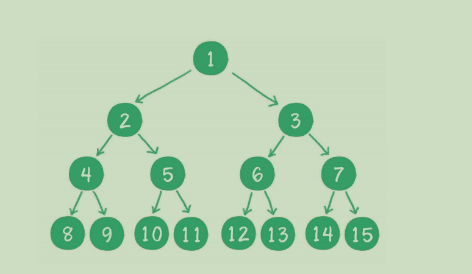
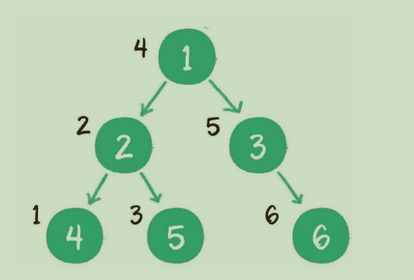
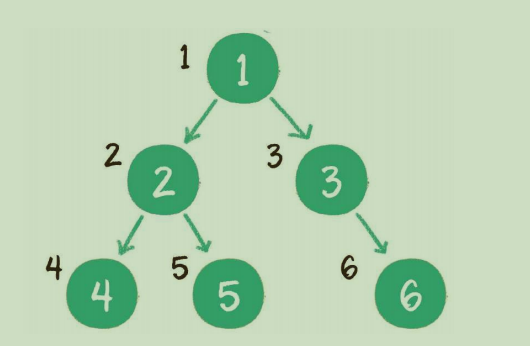

# 算法

## 衡量算法维度
1. 时间复杂度：执行代码所用的时间。 T(n) = O(f(n))
+ 如果运算时间是常量，用常数1表示 T(n)=2 => T(n) = O(1)
+ 只保留函数中最高阶项: T(n)=0.5n^2+0.5n => T(n) = O(n^2)
+ 最高阶省去前面的系数: T(n)=5logn => T(n) = O(logn)
执行时间长度：n足够大时
O(1) < O(logn) < O(n) < O(nlogn) < O(n^2)
2. 空间复杂度：执行代码所占存储空间 S(n) = O(f(n))
+ 常量空间: S(n) = O(1)
+ 线性空间: S(n) = O(n),分配的空间是线性的集合，比如数组
+ 二维空间: S(n) = O(n^2)
+ 递归空间: S(n) = O(n),递归所需内存空间和递归的深度成正比


log₂16:log以2为底，16的对数， 2的多少次幂等于16；2⁴ = 16，所以log₂16=4

log16:log以10为底，16的对数,可以省略10，10的多少次幂等于16，10¹ < 16 < 10²，所以计算机可以得出 log16 ≈ 1.2041
## 数据结构
1. 线性结构:
  + 数组、
  + 链表(单项链表每一个节点包含两部分，一部分存放数据的变量data,另一部分是指向下一个节点的next指针，如果是双向链表，还拥有指向前置节点的prev指针)
  

  
  + 栈（先进后出）
  + 队列（先进先出）
  + 哈希表（也叫散列表，key-value映射）
2. 树：
  + 树（节点1是根节点，5，6，7，8，9是叶子节点，虚线部分是根节点1的一个子树）
  
  + 二叉树（这种树的每个节点最多有2个孩子节点，可以没有）
  
  + 满二叉树（每一个分支都是满的）
  
  + 完全二叉树（最后一个节点之前的节点都齐全）
  
  + 二叉查找树（如果左树不为空，左子树所有节点值均小于根节点的值；如果右子树不为空，右子树所有节点值均大于根节点的值）
  
  + 二叉树深度优先遍历：分为以下三种
    + 前序遍历：输出顺序是根节点、左子树、右子树
      
    + 中序遍历：输出顺序是左子树、根节点、右子树
      
    + 后序遍历：输出顺序是左子树、右子树、根节点
      
  + 二叉树广度优先遍历
      
  + 二叉堆
    + 最大堆：堆顶是整个堆中最大元素
    + 最小堆：堆顶是整个堆中最小元素
3. 图
4. 其他数据结构：跳表、哈希链表、位图

## 排序

 
## 实现new
1. 创建一个新的空的对象
2. 将构造函数的作用域赋给新对象（因此this就指向了这个新对象）
3. 执行构造函数中的代码（为这个新对象添加属性）
4. 如果这个函数有返回值，则返回；否则，就会默认返回新对象
 

## 实现继承
### ES5中实现继承
  ```js
    //实现一下继承
    function Parent() {
      this.name = "大人"
      this.hairColor = "黑色"
    }

    function Child() {
      Parent.call(this)
      this.name = "小孩"
    }

    Child.prototype = Object.create(Parent.prototype)
    //将丢失的构造函数给添加回来
    Child.prototype.constructor = Child

    let c1 = new Child()
    console.log(c1.name, c1.hairColor) //小孩，黑色
    console.log(Object.getPrototypeOf(c1))
    console.log(c1.constructor) //Child构造函数

    let p1 = new Parent()
    console.log(p1.name, p1.hairColor) //大人，黑色
    console.log(Object.getPrototypeOf(p1))
    console.log(p1.constructor) //Parent构造函数
  ```

### ES6中实现继承
  ```js
    class Parent {
      constructor() {
        this.name = "大人"
        this.hairColor = "黑色"
      }
    }

    class Child extends Parent {
      constructor() {
        super()  //调用父级的方法和属性
        this.name = "小孩"
      }
    }

    let c = new Child()
    console.log(c.name, c.hairColor) //小孩 黑色

    let p = new Parent()
    console.log(p.name, p.hairColor) //大人 黑色
  ```


## 实现一个instanceof
  ```js

function myInstanceof(left,right) {
    if(typeof left !== 'object' || left === null) return false
    //获取原型
    let proto = Object.getPrototypeOf(left)
    while(true){//无限循环
        //如果原型为null，则已经到了原型链顶端，判断结束
        if(proto === null) return false
        //左边的原型等于右边的原型，则返回结果
        if(proto === right.prototype) return true
        //否则就继续向上获取原型
        proto = Object.getPrototypeOf(proto)
    }
}
  ```


## Call的实现
call让一个对象调用另一个对象的方法。你可以使用call()来实现继承：写一个方法，然后让另外一个新的对象来继承它（而不是在新对象中再写一次这个方法）

  ```js

function fn1(){   
    console.log(1);
}
function fn2(){    
    console.log(2);
}
Function.prototype.call = function (context) {
    this()
}
 
fn1.call(fn2);     //输出 1 .执行了fn1函数，但是fn1 的this指向了fn2
fn1.call.call.call(fn2);  //输出 2 相当于 call.call(fn2),执行了call方法，call里的this指向了fn2
call的作用
A.call(B,x,y)；让函数call执行，函数call执行，主要有两个作用
改变函数A函数体中的this指向，使之指向B，也就是this =B；
让A函数执行，把第二个及以后接受的参数值，传递给A函数，也就是A(x,y);
 
Function.prototype.call = function (context) {
    if (typeof context === "undefined" || context === null) {
        context = window
    }
    context.fn = this//（ 谁调用了call， this指的就是谁， 比如上面的A, 要让A函数执行， 所以得是个fn， 要让A中的this指向B， 则context.fn代表B调用了fn, 此时fn里面的this就是context， 即B）
    const args = [...arguments].slice(1) //类数组转为数组，去除了第一个参数B
    const result = context.fn(...args) //让A函数执行
    delete context.fn
    return result
}
```


+ 首先context为可选参数，如果不传的话默认上下文是window
+ 接下来给content创建一个fn属性，并将值设置为需要调用的函数；让 this 关键字指向这个属性 ，即 context.fn = this ； 注意 ： 在这里的 this 对象指向的是调用call()函数的函数对象。如 fn1.call(fn2)；在执行 call 函数时，call 函数内部的this指向的是fn1；
+ 因为call可以传入多个参数作为调用函数的参数，所有需要将参数剥离出来(把第一个参数剔除)
+ 然后调用函数并将对象上的函数删除
 

## Apply的实现
  ```js

Function.prototype.myApply = function(context) {
    if (typeof this !== 'function') {
        throw new TypeError('Error')
    }
    context = context || window
    context.fn = this
    let result
    if (arguments[1]) {
        result = context.fn(...arguments[1])
    } else {
        result = context.fn()
    }
    delete context.fn
    return result
}
  ```

## bind的实现
1. bind方法可以绑定this指向，绑定参数
2. bind方法返回一个绑定后的函数（高阶函数）（一个函数的参数有函数或者返回是一个函数）
3. 如果绑定的函数被new了，当前函数的this就是当前的实例
4. new出来的结果可以找到原有类的原型
  ```js
Function.prototype.bind = function (context) {
    let that = this
    let bindArgs = Array.prototype.slice.call(arguments, 1)
    //取到bind方法传过来的参数‘猫’
    function Fn() {} //object.create()原理
    function fBound() { //this
    let args = Array.prototype.slice.call(arguments)
    //取到bingFn （9）里面的参数
    return that.apply(this instanceOf fBound ? this : context,  bindArgs.concat(args))//两种调用方式
}
Fn.prototype = this.prototype
fBound.prototype = new Fn()
    return fBound
}
 
 
//调用
let obj = {
    name: '小明'
}
function fn(name, age) {
    Console.log(this.name + '有一只' + name + age +'岁了')
    //打印结果：小明有一只猫9岁了
}
//参数可以分两块传递
let bingFn = fn.bind(obj, '猫')
bingFn(9) //第一种调用
let instance = new bingFn(9) //第二种调用
fn.prototype.flag = 'dd'
console.log(instance.flag)
 
```

 
## 数组去重以及每个元素出现的次数
  ```js

function uniq(arr) {
    var newArr = [],numArr = []
    for(var i=0;i<arr.length;i++){
        numArr[i] = 1
        if(newArr.indexOf(arr[i])<=-1){
            newArr.push(arr[i])
        } else {
            numArr[i]++
        }
    }
    console.log(newArr,numArr)
    return newArr
}
  ```
 
## 手写promise
promise的几个特点：
1. 是一个类（需要 new Promise实例化调用）
2. 三种状态PENDING， RESOLVEDRE，JECTED，只能从PENDING-》RESOLVEDRE，PENDING-》JECTED
3. promise的实例都有一个then方法，有两个参数，一个是成功的回调，一个是失败的回调。then方法可以链式调用
4. promise默认执行器立即执行,如下面的executor
5. 有异常执行reject 方法
6. Promise.then链式调用的返回值可以传到下一个then中去。
+ 如果返回的是普通值（不是promise,不是错误）（不管是resolve，还是reject返回的）都会传递到下一个then的resolve方法中；
+ 第一个then出错一定会传递到后面then的reject中；
+ 如果第一个then返回的是一个promise,则会根据promise的状态决定走到下一个then的resolve还是reject；
+ 错误处理，如果离自己最近的then没有错误处理 会向下找下一个then的错误回调
+ 每次执行完一个promise.then方法后返回的都是一个新的promise

代码如下：
  ```js

Const PENDING = ‘PENDING’//等待态
Const RESOLVED = ‘RESOLVED’//成功态
Const REJECTED = ‘REJECTED’//失败态
Class Promise {
    constructor(executor) {
         this.status = PENDING;duo
         this.value = undefined;//成功返回的值
         this.reason = undefined;//失败返回的值
         this.onResolvedCallbacks = [] //成功的回调
        this.onRejectedCallbacks = [] //失败的回调
        let resolve = (value)=>{
            if(this.status === PENDING){
                this.value = value
                this.status = RESOLVED
                this.onResolvedCallbacks.forEach((fn)=>fn())
                }
        }
        let reject = (reason ) =>{
             if(this.status === PENDING){
                  this.reason = reason
                  this.status = REJECTEDt
                  this.onRejectedCallbacks.forEach((fn)=>
                    fn())
                    }
            try{
                executor(resolve, reject) //立即执行函数
            }catch(e){
                reject (e) //错误处理有异常抛出 直接执行reject
            }
        }
    }
    then(onFulfilled, onRejected){
        // 为了实现链式调用
        let promise2 = new Promise((resolve,reject)=>{})
        return promise2
 
        if(this.status === RESOLVED){
            let x = onFulfilled(this.value)
            resolve（x）
            //将第一层then的结果传递给第二层then的resolve
        }
        if(this.status === REJECTED){
            onRejected(this.reason )
        }
        //pending状态里有异步操作时,会把resolve,reject的事件都收集起来，等到里resolve,reject时再去执行收集到的resolve,reject事件
        if(this.status === PENDING) {
            this.onResolvedCallbacks.push(()=>{
                onFullfilled(this.value)
            })
            this.onRejectedCallbacks.push(()=>{
                onRejected(this.reason )
            })
        }
    }
}
module.exports = Promise
 
实例调用如下
let Promise = require(‘./Promise’)
let promise = new Promise((resolve,reject)=>{
    setTimeout(()=>{
        resolve(‘success’)
    },1000)
})
promise.then((data)=>{
    console.log(‘success’,data)
},(err)=>{
    console.log(‘err’,err)
})
  ```

### 异步、作用域、闭包
  ```js
    for (var i = 0; i < 3; i++) {
    setTimeout(function () {
          console.log(i) // 3s 后输出 3次3
    }, 30 * 100)
      console.log(i) // 先输出 0 1 2
    }
  ```
结果 ：0 1 2    3 3 3

原因：settimeout是异步执行，10ms后往任务队列里面添加一个任务，只有主线上的全部执行完，才会执行任务队列里的任务，当主线执行完成后，i是3，所以此时再去执行任务队列里的任务时，i全部是3了。

对于打印3次原因是： 每一次for循环的时候，settimeout都执行一次，但是里面的函数没有被执行，而是被放到了任务队列里面，等待执行，for循环了3次，就放了3次，当主线程执行完成后，才进入任务队列里面执行。

  ```js
    for (let i = 0; i < 3; i++) {
      setTimeout(function () {
        console.log(i)// 3s 后输出 0 1 2
      }, 3000)
      console.log(i) // 先输出 0 1 2
    }
  ```
结果 ：0 1 2    0 1 2

原因：因为for循环头部的let不仅将i绑定到for循环块中，事实上它将其重新绑定到循环体的每一次迭代中，确保上一次迭代结束的值重新被赋值。setTimeout里面的function()属于一个新的域，通过 var 定义的变量是无法传入到这个函数执行域中的，通过使用 let 来声明块变量，这时候变量就能作用于这个块，所以 function就能使用 i 这个变量了。

由于 var 命令的变量提升机制，var 命令实际只会执行一次。而 let 命令不存在变量提升，所以每次循环都会执行一次，声明一个新变量（但初始化的值不一样）。for 的每次循环都是不同的块级作用域，let 声明的变量是块级作用域的，所以也不存在重复声明的问题。let声明变量的for循环里，每个匿名函数实际上引用的都是一个新的变量
  ```js
    for (var i = 0; i < 3; i++) {
      (function (j) {
        setTimeout(() => {
          console.log(j) //3s后输出 0 1 2 
        }, 3000)
      })(i)//把实参i赋值给形参j
    console.log(i) //先输出 0 1 2
    }
  ```
结果 ：0 1 2    0 1 2

原因：这个函数里有个立即执行函数（立即执行函数，形如(function(){})()是定义一个函数，并立即执行。它只能被使用一次，相当于“阅后即焚”），每一次循环都是一个独立的作用域，可以拿到当前循环时i的值

### 立即执行函数的作用
+ 不必为函数命名，避免了污染全局变量（没有命名的函数也叫匿名函数）
+ 立即执行函数内部形成了一个单独的作用域，可以封装一些外部无法读取的私有变量
+ 封装变量

所谓闭包，要拆成闭和包，闭指代不想暴露给外部的数据，包指代将数据打包出去暴露给外部；之所以这么说原因在于JS的函数作用域，函数内部的变量函数外部无法访问，这形成了闭；函数外部想得到函数内部的变量，可以通过某些方法譬如通过return等语句将内部的变量暴露出去，这形成了包；因而——立即执行函数只是函数的一种调用方式，和闭包没有必然的联系；闭包是和作用域扯上关系的，而(function(){})()是函数声明完就执行，只是有时想要用到闭包那么可以用(function(){})()来构成闭包，而不是(function(){})()是闭包。闭包的本质是执行完后只返回有用的数据，包内变量完全销毁，防止全局污染。